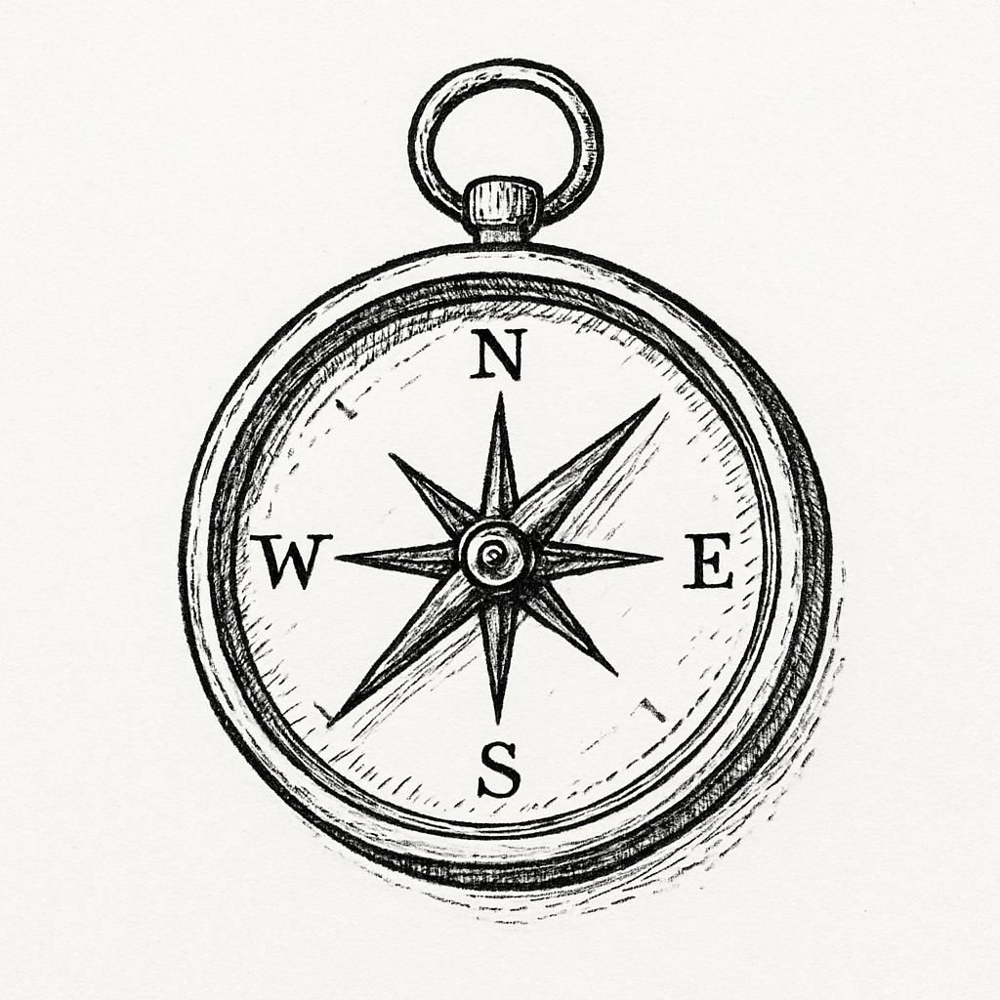
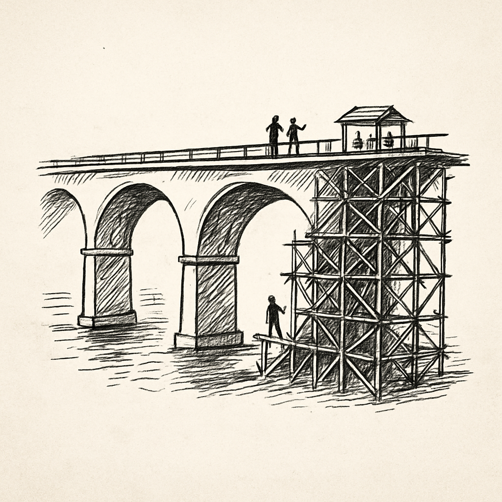
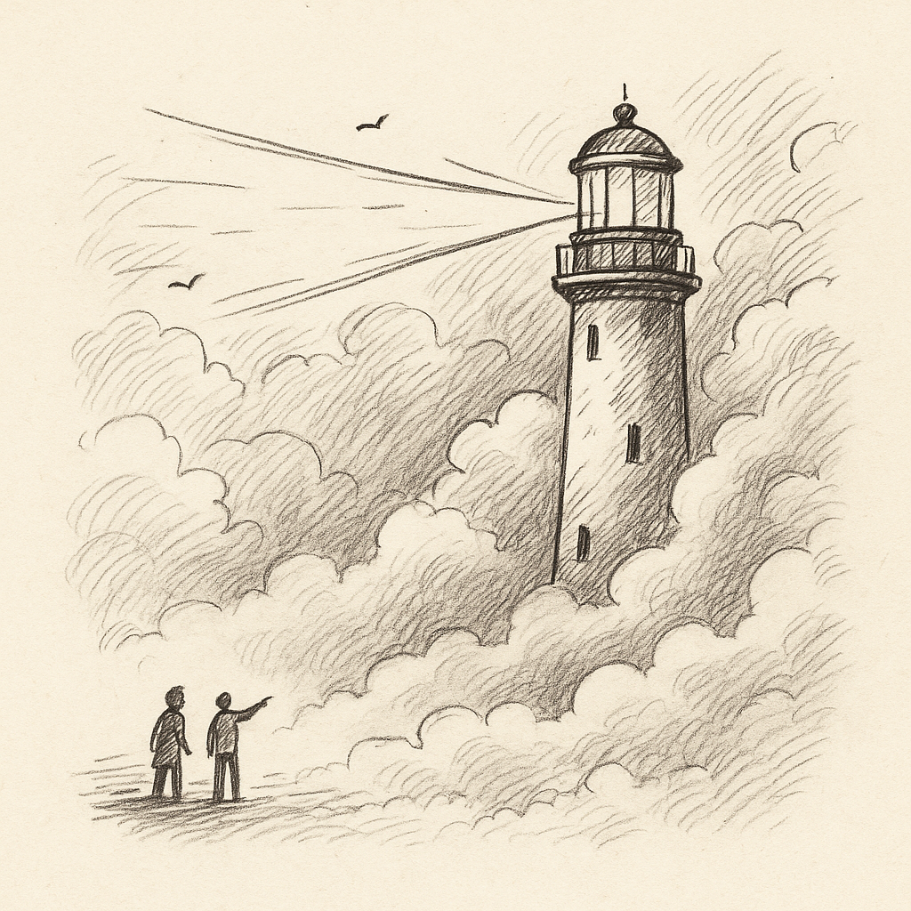
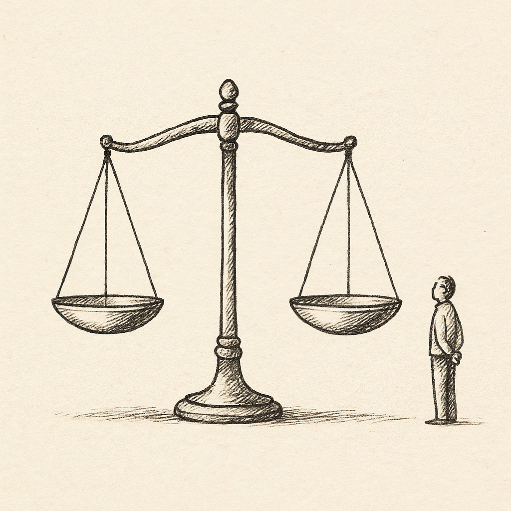
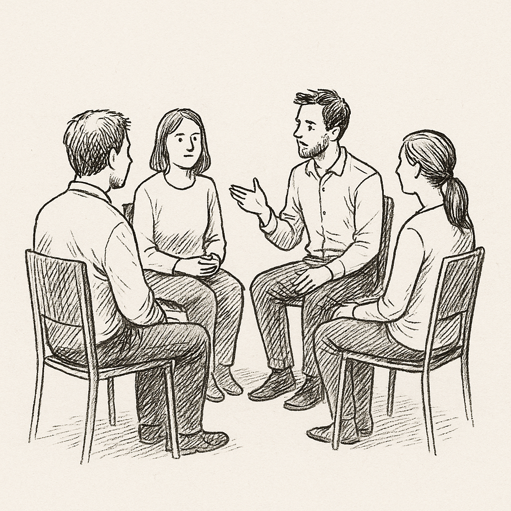
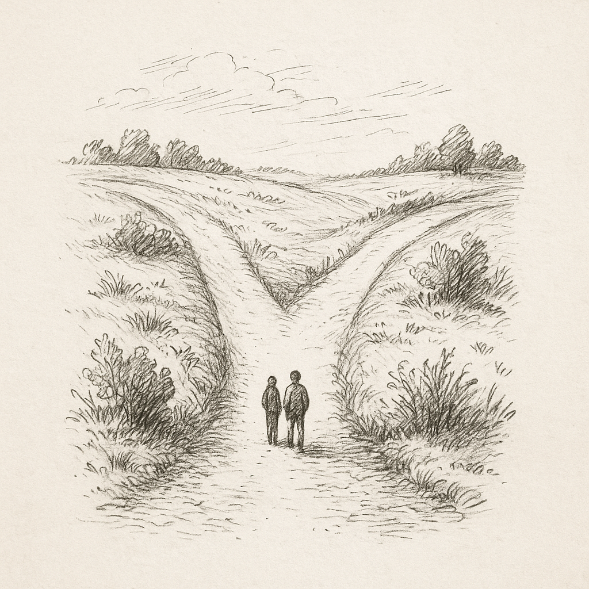
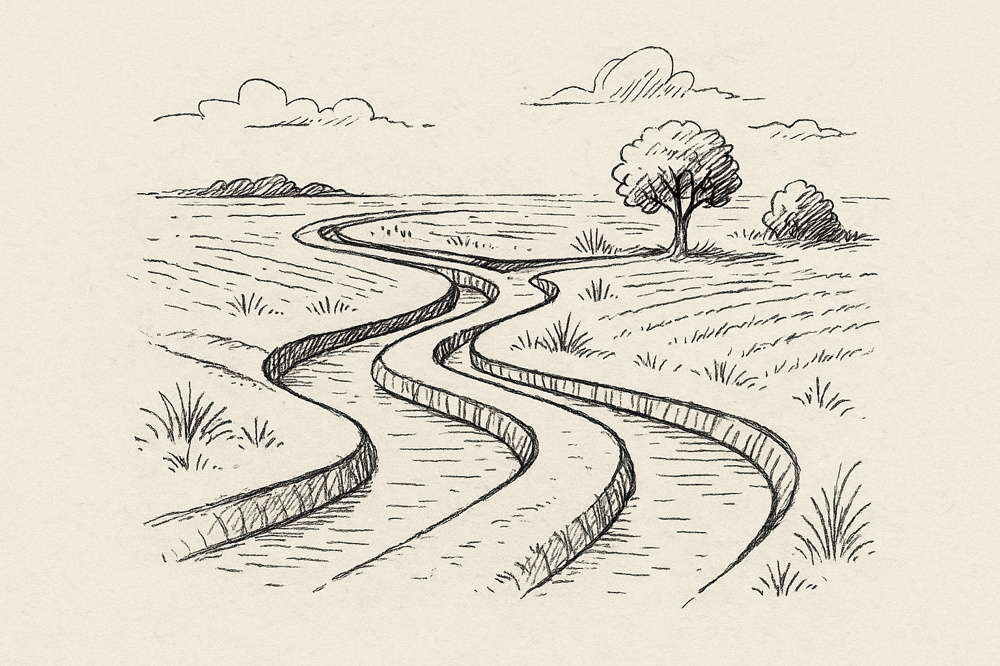
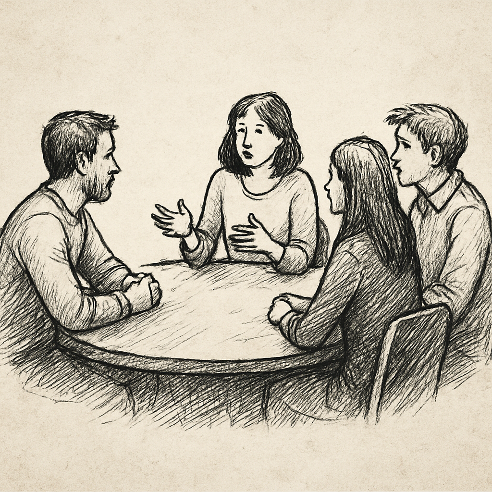
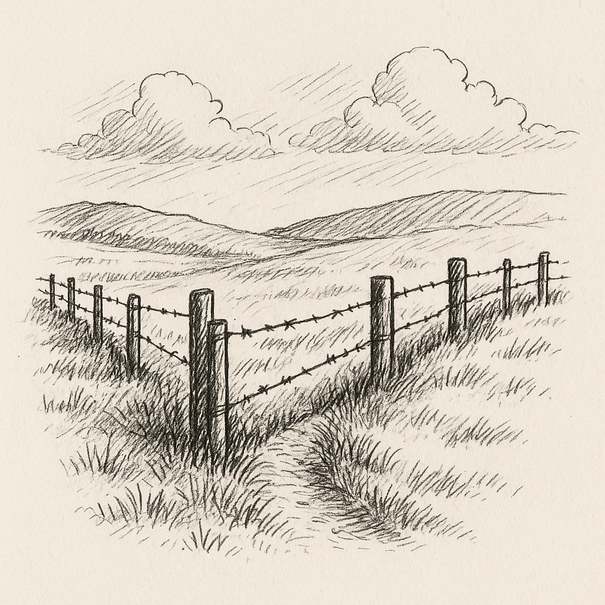
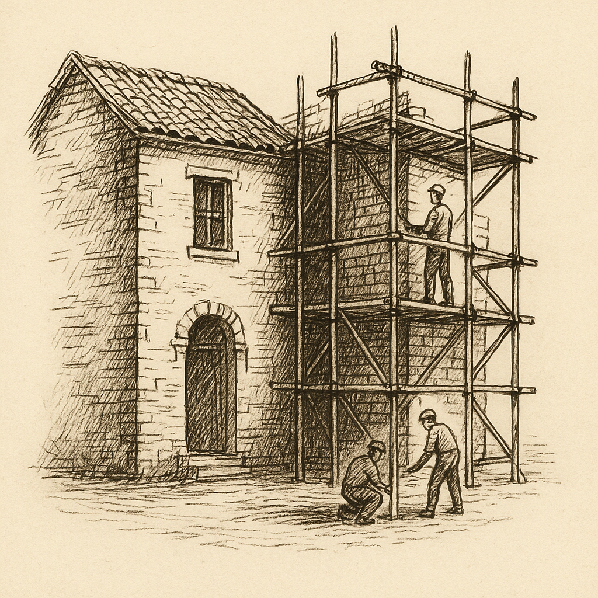

# The Good, Bad and Ugly

## How architects can facilitate high-impact decisions

### SAR - Nov 2025

<!--
NOTES:
Set the tone: This session is about architecting *decisions*, not just systems.
Say: "As engineers, we solved problems ourselves. As architects, we solve problems *with and through others.* 
This session is about learning to guide decision-making when there are competing priorities, imperfect information, and real trade-offs."

"The skill is not in *choosing the right answer*, but in *creating the conditions where a good decision can emerge and be owned.*"

-->

---

## How We’ll Work Together Today

We’ll move between **concepts** and **practice** throughout the session.

 

| Segment | Duration | Format |
|---|---|---|
| Concept intro & framing | 10 min | Facilitated |
| Scenario 1 | 25 min | Introduce → Breakout → Share back |
| Scenario 2 | 25 min | Introduce → Breakout → Share back |
| Scenario 3 | 25 min | Introduce → Breakout → Share back |
| Key takeaways & close | 5 min | Facilitated |

 

**Your role:** Think out loud, collaborate, and be curious — there are no “right” answers.

<!--
NOTES:
Say:
"This is not a lecture. It's a working session. We’ll learn a decision-framing approach, and then we’ll *use it immediately* in real scenarios."

Point to the rhythm of the workshop:
"Each scenario follows the same pattern — I introduce context, you break out and work through the decision, we reconvene and share. This rhythm is intentional — it gives you repeated practice in the same skill."

Reassure:
"You don't have to be an expert in the scenario domain. What matters is *how* you frame and reason about the decision."

Land the tone:
"The goal today is not to be right. The goal is to become more *deliberate* in how we enable decisions."
-->

---

## The Architect’s Core Responsibility

**Not** to make all the decisions.  
**But** to enable decisions that:

- Align with business outcomes  
- Are technically sustainable  
- Are understood and owned by teams  

<!--
NOTES:
Anchor the identity shift clearly and directly.

Say:
"Many architects fall into the trap of believing their value comes from having the answer. But the moment one person becomes the single point of truth, two things happen: the team slows down, and the architecture becomes fragile."

Point to the bridge:
"This bridge represents what great architects do — they create a *path* for others to move across uncertainty safely. Not by dictating direction, but by shaping the environment in which good decisions can happen."

Then emphasize ownership:
"Our goal is to enable decisions that the *teams themselves own* — decisions that make sense in the context of business goals, can be sustained over time, and that don't fall apart when leadership or personnel changes."

Pause.

Land it:
"You are not here to be the smartest person in the room. You are here to make it possible for the room to be smart together."

-->

---

## Why Big Decisions Fail

- Rationale was *implicit*
- Stakeholders lacked shared understanding
- Trade-offs weren't surfaced
- Alignment was forced, not built

**Architects create clarity — not just diagrams.**

<!--
NOTES:
This is where we name the *real* failure mode in architectural decisions: not technical wrongness, but missing shared understanding.

Say:
"Most big architecture decisions don't fail because the tech was wrong. They fail because the reasoning behind the decision was never made explicit."

Point to each bullet slowly:
- "The rationale lived in someone’s head."
- "Different stakeholders had different assumptions."
- "The trade-offs were never surfaced, so they were never consciously chosen."
- "And alignment wasn’t built — it was *declared.* And declared alignment is just compliance in disguise."

Pause. Let the room recall a memory.

Then gesture to the lighthouse:
"This is why the lighthouse metaphor matters. The architect’s job is to illuminate the space — to make the constraints, the risks, and the choices *visible.* Not to drag people to an answer, but to help them *see together.*"

Land it:
"We don’t create clarity *after* the decision. We create the clarity that makes the decision possible."
-->

---

## Three Dimensions of Effective Architecture Decisions

| Dimension | Guiding Question | Architect Role |
|---|---|---|
| Technical | Is it viable and maintainable? | Surface constraints & trade-offs |
| Organizational | Who owns and operates it? | Clarify accountability & boundaries |
| Strategic | How will it evolve? | Consider long-term path & risks |

<!--
NOTES:
This is where you introduce the mental model that participants will *use* in the breakouts.

Say:
"When we make architectural decisions, we often evaluate only the technical dimension — scalability, latency, maintainability. But real architectural decisions succeed or fail in the *intersection* of these three dimensions."

Walk the table slowly:

**Technical** — "Is this solution sound and something we can live with operationally?"
**Organizational** — "Who actually owns this? Who feels the pain? Who carries the pager?"
**Strategic** — "What happens when this system needs to evolve, scale, or intersect with future business needs?"

Pause.

Then drive the key point:
"Great architects don’t choose the 'best' option. They help groups understand the *trade-offs across these dimensions* clearly enough that the decision becomes shared and intentional."

Land it:
"The craft is not in *optimizing* one dimension — it’s in *balancing* them so the system and the organization can move forward together."
-->

---

## Architect as Decision Facilitator

Strong architects:

- Create shared understanding **before** debating solutions
- Make trade-offs **explicit**
- Guide groups toward **good-enough** forward decisions
- Capture rationale (lightweight ADRs)

<!--
NOTES:
This is the emotional center of the workshop. Deliver slowly and with presence.

Say:
"When we talk about the architect as a decision facilitator, we’re not talking about being passive. We’re talking about being *deliberate* in how we shape the conversations that lead to decisions."

Point to the first bullet:
"Before we debate solutions, we make sure everyone is solving the same problem. If we don’t create shared understanding first, the conversation is just people defending their assumptions."

Second bullet:
"Trade-offs are not signs of weakness or compromise. They are the *shape* of every meaningful decision. Strong architects make those trade-offs visible so people understand what they are choosing *and* what they are giving up."

Third bullet:
"The goal is not the perfect solution — the goal is a decision that the team can live with, move forward with, and evolve. Progress beats perfection every time."

Fourth bullet:
"And capturing rationale isn’t bureaucracy. It’s preventing teams from reliving the same conversation every three months. It preserves alignment across time."

Pause.

Land the identity shift clearly:
"The power of an architect is not in having the answer. It’s in creating the conditions where the *right decision can emerge and be owned by the people who will carry it forward.*"
-->

---

## Decision Framing Template

1. **Decision** being made  
2. **Options** considered  
3. **Trade-offs** that matter  
4. **Recommendation & why**  
5. **Risks & assumptions** to monitor

We'll use this in the scenarios.

<!--
NOTES:
Frame this as a *thinking aid*, not a template to fill out.

Say:
"This isn't a form or a checklist. It's a way to slow down just enough to make the reasoning visible. Think of it as scaffolding for clearer conversations."

Walk through it conversationally:
1. "First — what decision are we actually making? Not the whole problem — just the part we need to decide *now.*"
2. "Then — what are the real options? Not the 12 theoretical ones. The 2–3 someone could actually choose in this context."
3. "Trade-offs are where the real work happens. What gets better? What gets harder? What are we *choosing* to care about?"
4. "The recommendation isn’t just 'this one is better' — it's 'here’s why this option fits *our* moment, *our* constraints.'"
5. "And risks and assumptions are not for CYA — they give us a way to *monitor the decision as it lives.*"

Pause.

Reassure:
"You do *not* need to document this perfectly. Even capturing 20% of this thinking makes decisions exponentially easier to explain, revisit, and evolve."

Land it:
"This is a conversation tool. Not a governance document."
-->

---

## Scenario 1

### From Nightly Batch to Near Real-Time Analytics

**Context:**  
Retail analytics dashboards run nightly. Business wants **<5 min** freshness.

**Current Reality:**  

- Snowflake warehouse  
- Airflow + Python ETL  
- Some stores send **daily CSV uploads**  
- Data engineering team of **4**

<!--
NOTES:
Acknowledge that this first scenario is intentionally comfortable and technical.

Say:
"We’re starting with a scenario that many of you may have seen before: moving from nightly batch analytics to something closer to real time. This is a *gentle start* because the domain is familiar — data pipelines, latency, cost, operational trade-offs."

Then reframe the goal:
"But the point is not to design the perfect streaming architecture. The point is to practice *how we frame the decision* — to make sure we’re solving the right problem, not just upgrading technology."

Then ask the anchor question:
"What *decision* depends on having data fresher than nightly? What changes in the business based on having <5 minute visibility?"

Let the room *sit* with the value question before anyone mentions Kafka.
-->

---

### Scenario 1 — Key Decision

**How should the data ingestion architecture evolve?**

Options:

- Micro-batch (1–10 min)
- Introduce streaming pipelines
- Hybrid / phased approach

**Focus:**  
Is real-time worth the cost *now*?

<!--
NOTES:
Focus the group away from tools and toward sequencing and trade-offs.

Say:
"Every one of these options is technically possible. The question is not 'can we do it?' — it's 'what is the smallest meaningful step that creates value *now* without locking us in?'"

Point to options slowly:
- "Micro-batching might get us 80% of the value with 20% of the change."
- "Streaming introduces new operational and skill requirements."
- "A phased approach lets us learn our way into maturity."

Then emphasize:
"We are not trying to be right forever. We are trying to be safe-to-evolve."

Close with:
"This first scenario is our warm-up. The mechanics are familiar. The *thinking pattern* is what we’ll carry forward."
-->

---

### Breakout (10 minutes)

Use the decision framing template.

<!--
NOTES:
During walkaround, ask: "What is the *smallest* meaningful improvement?"
-->

---

## Scenario 2  

### Clarifying Service & Data Boundaries (Fintech)

**Context:**  
Two teams share the **Customer Profile** table.

| Team | Owns | Writes | Problem |
|---|---|---|---|
| Onboarding | Identity/KYC | Yes | Needs correctness/privacy guarantees |
| Accounts | Account lifecycle | Yes | Needs stable references & updates |

**Regulator requires clear **data stewardship**.

<!--
NOTES:
Name the shift clearly — this scenario is not about technology selection, but about *ownership, responsibility, and trust.*

Say:
"Unlike Scenario 1, this one is not primarily about infrastructure or latency. This one sits in the intersection of data, accountability, and regulatory pressure."

Point to the shared table:
"Two teams write to the same Customer Profile data. Both have valid reasons. Both have legitimate constraints. And because ownership is unclear, *nobody actually owns correctness end-to-end.*"

Then emphasize:
"This is where architecture becomes less about what we build, and more about how we define responsibility and boundaries."

Pause.

Land the key insight:
"Data ownership drives service boundaries — not the other way around."

Let them settle with that before going to the decision slide.
-->

---

### Scenario 2 — Key Decision

**Where should the source of truth live, and how do others consume it?**

Likely Patterns:

- One authoritative Profile service
- Other services consume via APIs/events
- Local read models where needed

<!--
NOTES:
Shift the conversation from "what the architecture should be" to "how to *move* from current reality to something healthier."

Say:
"All of these patterns are viable. The real decision is not the *shape* of the end-state. It’s how to get there without breaking the business or the teams."

Emphasize:
"The moment we designate a single source of truth, we implicitly change ownership, workflows, SLAs, escalation paths, and team identity. That’s why this is hard — and why it requires facilitation, not authority."

Then guide the breakout:
"Don’t jump to the final architecture. Focus on the *transition path.* What changes first? Who needs to buy in? What becomes easier or harder? Where are the risks in handoff?"

Close with:
"This scenario is less about choosing the right architecture, and more about designing a decision that the people affected can actually *live with.*"
-->

---

### Breakout 2 (10 minutes)

Use the decision framing template.

<!--
NOTES:
Prompt stuck groups: "Who suffers the most if data is wrong?"
-->

---

## Scenario 3

### Rewrite vs Incremental Evolution

**Context:**  
SaaS platform performance & maintainability issues → leadership suggests rewrite.

**Realities:**  

- Current system = **90% revenue**
- Competitor advancing
- Mixed engineering skill levels
- Unknown behavior embedded in production

<!--
NOTES:
Name the emotional tone — this is the moment where architecture touches fear, pressure, and urgency.

Say:
"This scenario shows up everywhere. The system is aging. Everyone feels the pain. A competitor appears. Leadership says, 'Maybe it’s time to rewrite.' And that suggestion feels clean, liberating, refreshing — like we could finally start over and get it right this time."

Pause.

Then shift:
"But systems aren’t just code. They are *accumulated domain knowledge.* Every bug fixed, every workaround discovered, every exception handled — all of that lives inside the current system. A rewrite doesn't just replace the code — it erases the learning."

Call attention to the scaffold image:
"The real question here isn’t 'rewrite or refactor?' It’s: *How do we evolve something that we depend on every day, without breaking the business that depends on it?'*"

Land the core insight slowly:
"Rewrites feel clean. Evolution feels slow and messy. But evolution is where resilience comes from."
-->

---

### Scenario 3 — Key Decision

Options:

1. Full rewrite  
2. Gradual refactor (Strangler pattern)  
3. Parallel V2 with staged migration  

Evaluation Criteria:

- Risk tolerance
- Migration complexity
- Business continuity risk

<!--
NOTES:
Ask the question that forces real architectural thinking.

Say:
"Every one of these options has failure modes. The real question is: which option fails most gracefully if we are wrong?"

Walk the options:

1. Full rewrite:
"Clean slate. Also maximum risk. Rewrites rarely fail halfway — they fail all at once, when it's too late to correct."

2. Gradual refactor:
"Safer, but requires patience, clarity on sequencing, and strong technical leadership. This is where scaffolding, not demolition, is the metaphor."

3. Parallel V2:
"Sounds like the best of both worlds, but often doubles operational cost and splits team focus."

Then shift:
"The decision here isn’t about architecture style. It's about appetite for risk, continuity of revenue, and how fast the organization can learn."

Finally:
"In this breakout, don’t choose the 'right' answer. Choose the answer that the business can *survive if it’s wrong.* And outline how the organization would *learn* as it goes."
-->

---

### Breakout 3 (10 minutes)

Use the decision framing template.

<!--
NOTES:
Listen for migration strategy maturity, not solution shape.
-->

---

## Key Takeaways

| Architects Don’t | Architects Do |
|---|---|
| Chase perfect designs | Enable forward movement with clarity |
| Decide alone | Facilitate shared reasoning |
| Focus only on tech | Consider org + strategy too |
| Hide uncertainty | Make risks & assumptions explicit |

<!--
NOTES:
Deliver this slide slowly. The aim is not to *teach* now — it is to help them recognize themselves in this new role.

Say:
"Look at the left column. These are the instincts we often start with when we move into architecture — be the expert, be right, provide the answer, eliminate uncertainty."

Pause.

Then move to the right column:
"But the reality of modern systems and organizations requires something different. Something quieter, but more powerful."

Explain each contrast as a shift in posture:
- "Instead of chasing perfect designs, we enable forward movement."
- "Instead of deciding alone, we facilitate shared reasoning."
- "Instead of focusing only on the technology, we pay attention to teams, ownership, and evolution."
- "Instead of hiding uncertainty, we make assumptions and risks visible — to reduce future regret."

Then say:
"This is not about changing your personality. It's about broadening your impact."

Let the room breathe for a beat.
-->

---

## Final Thought

Great architects are **not defined by the answers they give**,  
but by the **clarity and alignment they enable when stakes are high.**

<!--
NOTES:
This slide is the emotional anchor of the workshop. Speak slowly, and then be silent for a full second before thanking the group.

Say:
"As engineers, we were rewarded for having the right answer. But as architects, the work shifts. We become the ones who make it possible for others to move forward with clarity and confidence."

Then repeat the line on the slide, with genuine emphasis:
"Great architects are not defined by the answers they give — but by the clarity and alignment they enable when stakes are high."

Pause.

Then close simply:
"Thank you for leaning into this today."

No jokes. No chatter. Let the thought stand.
-->